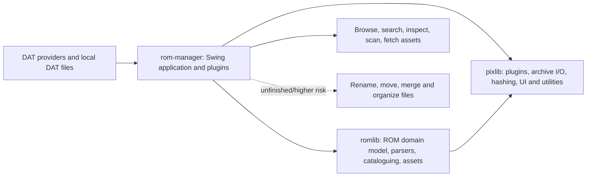

# ROM Manager current-status assessment

Assessment date: 2026-08-08

## Executive assessment

The project is a functional advanced prototype/alpha, with a genuinely substantial ROM-domain core. It is already capable of discovering, classifying, and fully parsing the current DAT corpus into usable game, ROM, clone, platform, attribute, and asset models. It is not yet a safe, reproducible general-purpose ROM manager: build/release automation is weak, the main application and `romlib` have no automated tests, and parts of the organizer/mover path are explicitly unfinished.

The best near-term product shape is a **safe DAT browser and ROM auditor** first, followed by a separately hardened **file organizer**. Browsing and parsing are much further along than mutation of users' ROM collections.

## Project map

| Project | Size inspected | Current responsibility | Assessment |
| --- | ---: | --- | --- |
| `rom-manager` | 141 Java files / ~13.5k lines | Swing UI, plugin registration, DAT discovery, scanning, organization, persistence, fetchers | Functional application shell with strong browsing/import paths and uneven file-management paths |
| `romlib` | 111 Java files / ~8.3k lines | Game/ROM/set model, platforms, hashes, clones, parsers, cataloguers, assets, patches | The strongest and most reusable part of the system; needs tests and API cleanup |
| `pixlib` | 285 Java files / ~16.6k lines | Generic archive, digest, plugin, search, workflow, UI, logging, JSON/YAML utilities | Broad utility library; only a small portion is directly relevant to ROM Manager and tested |

The dependency direction is sensible: `rom-manager -> romlib -> pixlib`, with the application also using `pixlib` directly. The main architectural weakness is not the layering but the amount of shared mutable/global state in the application (`Main`, `GlobalSettings`, and helpers reaching back into `Main.setManager`).

## What is demonstrably working

### DAT discovery and provider recognition

The registered `DatGuesserPlugin` recognized all 9 files currently under `dat/` and assigned the expected provider/platform combinations:

- MAME arcade
- No-Intro: Atari 2600, GBA, NDS, NES, Switch, and Switch DLC
- Redump: PSP
- The Good Old Days: IBM PC

The current files use Logiqx-style XML even when their extension is `.dat`, so the active XML discovery route covers this corpus. The older OfflineList, legacy JSON, and ClrMamePro samples under `dat-old/` are not part of the current discovery smoke test.

### Full DAT parsing

A read-only runtime smoke test loaded every discovered set successfully:

| Set | Games | ROM records | Clone groups | Parse time in smoke test |
| --- | ---: | ---: | ---: | ---: |
| MAME | 11,540 | 160,055 | 6,064 | 481 ms |
| Atari 2600 / No-Intro | 791 | 797 | 662 | 22 ms |
| GBA / No-Intro | 3,392 | 3,392 | 1,709 | 46 ms |
| NDS / No-Intro | 7,518 | 7,518 | 3,887 | 80 ms |
| NES / No-Intro | 3,370 | 3,370 | 1,816 | 47 ms |
| Switch DLC / No-Intro | 6,914 | 9,136 | 6,913 | 89 ms |
| Switch / No-Intro | 31,458 | 37,900 | 31,455 | 371 ms |
| PSP / Redump | 2,864 | 2,864 | 1,704 | 38 ms |
| IBM PC / Good Old Days | 3,534 | 9,594 | 3,534 | 30 ms |

These timings are local smoke-test observations, not benchmarks, but they show that the model-building path handles both small cartridge sets and large MAME/Switch datasets without failure.

### Implemented product surface

The source contains coherent implementations for:

- platform-grouped ROM-set discovery and selection;
- game list/tree views, counts, status rendering, search, clone views, and detailed game/ROM attributes;
- Logiqx XML, OfflineList XML, and ClrMamePro parser plugins;
- No-Intro title/catalogue interpretation and clone generation, plus XMDB clone overrides;
- CRC/digest-based verification, binary/archive/nested-archive scanning, header transforms, CSO support, and shared-ROM handling;
- JSON persistence for global settings, per-set settings, plugin state, and game/ROM status;
- pluggable search, renaming patterns, folder organization, cleanup, download, parsing, provider, scanner, verifier, and format-support roles;
- asset storage, display, packaging, and fetchers for MobyGames and Libretro thumbnails;
- specialized older functionality such as IPS/UPS patches and GBA save/sleep patches.

The current uncommitted work is focused on the Libretro asset workflow: fuzzy-match modes, preview caching/scaling, broader DOS mapping, safer asset names, plugin-setting deserialization, and large-file CRC handling. A focused cross-project compile check of those modified Java files succeeded.

## Verification performed

| Check | Result |
| --- | --- |
| Focused compile of all currently modified production Java files across the three projects | Passed with Eclipse's bundled JDK 21 compiler using Java 10 language/API compatibility |
| Provider discovery against all current `dat/` files | 9/9 recognized |
| Full parse/model creation for all discovered DATs | 9/9 loaded |
| Active `pixlib` JUnit suite plus archive explorer tests | 19 tests passed |
| `rom-manager` automated tests | None present |
| `romlib` automated tests | None present |
| Fresh Maven reactor/package build | Not available: Maven is not installed/on PATH and there is no Maven wrapper or aggregate build |
| GUI end-to-end run | Not performed as part of this headless/read-only assessment |

`CompressorTest` currently has its only `@Test` annotation commented out, so running that class directly produces JUnit's “No runnable methods” initialization error. It is not part of the active passing test set.

## Main risks and gaps

### 1. File organization is not yet a dependable product feature

`Organizer` contains explicitly disabled or incomplete correctness checks and mutation paths:

- internal archive renaming throws `UnsupportedOperationException`;
- name checking throws `UnsupportedOperationException`;
- folder correctness currently always returns `true`;
- `isOrganized` is forced to `true`;
- one move path logs a move without performing it;
- some I/O failures are swallowed or only printed.

This is the largest user-data risk. Until the organizer is reworked around a previewable plan, conflict detection, and verified postconditions, the application should present itself as browse/audit capable and treat destructive organization actions as experimental or disabled.

### 2. Reproducible builds and releases are missing

All three POMs target Java 10 and use old compiler configuration. The application has a nonstandard `src` layout, an artifact name of `romizer`, duplicate JAXB dependencies, an old assembly plugin, and relies on separately available `com.pixbits:lib:0.1` and `com.github.jakz:romlib:0.1` artifacts. There is:

- no Maven wrapper;
- no parent/reactor build for all three projects;
- no CI configuration;
- no current packaged artifact (the jars under `target/` date from 2018 even though Eclipse class files are current);
- no documented launch or contributor setup in the main project.

Eclipse can clearly compile the projects, but another machine cannot reproduce that workflow from the repositories alone with confidence.

### 3. Test coverage does not protect the valuable domain behavior

The two most important layers have no tests. The successful DAT smoke test exercises a lot of behavior, but it is not checked into the project and uses the user's large local datasets. Small, legal fixture DATs are needed for:

- provider/platform/flavour guessing;
- Logiqx, OfflineList, and ClrMamePro parsing;
- multi-ROM games, shared ROMs, parent/clone relationships, and Redump multi-disc behavior;
- No-Intro title attribute extraction;
- status persistence round trips;
- archive and header-aware scanning;
- organizer planning and conflicts.

### 4. Failure contracts are inconsistent

Several loaders and adapters return `null` on error while callers assume a value, and production code contains many `printStackTrace` calls. For example, the Logiqx supplier catches any exception, prints it, and returns `null`; `GameSet.load()` then dereferences the result. This turns a useful parse error into a later null failure and makes the UI/logging experience unpredictable.

Errors should carry the DAT path, provider, format, and game/ROM context and be surfaced through one application-level error/reporting mechanism.

### 5. There are known correctness defects in foundational code

The clearest example is `DatFormat.is(String ident)`, which compares the argument with itself and therefore always returns `true` for non-null input. Other examples worth addressing include an unused scanner helper that advances its iterator twice, empty-stream assumptions such as `reduce(...).get()`, and identity derived from `path.toString().hashCode()` for guessed sets. Path hashes can change when a DAT is renamed and can collide, which threatens association with saved per-set state.

### 6. Provider-specific processing is too implicit

The active Logiqx loader always applies `NoIntroCataloguer`, `NoIntroNormalizer`, and clone solving, even for MAME, Redump, and Good Old Days. It happened to load the current corpus, but the smoke test produced very large amounts of catalogue diagnostic output from `NoIntroCataloguer`. Provider policy should be selected explicitly by provider/format rather than being baked into the generic Logiqx parser.

The older dedicated provider plugins are commented out in `Main.loadPlugins()`, leaving `DatGuesserPlugin` as the only active provider. The ClrMamePro and OfflineList parsers are registered, but the current provider discovery does not route arbitrary non-XML files to them.

### 7. Technical coupling will slow further UI evolution

The application uses many public static fields in `Main`, and `MyGameSetFeatures` reaches through `Main.setManager` for settings. Core operations also call Swing dialogs and frames directly. This makes headless testing, background processing, and eventual alternate front ends harder than necessary.

This does not require a rewrite. Introducing a small application context/service layer around set selection, settings, progress, logging, and user prompts would let existing Swing code migrate incrementally.

### 8. Dependency and packaging hygiene needs an audit

Several dependencies and build plugins are pinned to old versions, including Gson 2.3.1, jsoup 1.8.2, zip4j 1.3.2, jparsec 2.2.1, and `maven-assembly-plugin` 2.2-beta-4. SevenZip native bindings also appear in multiple versions in the existing runtime library directory. Before distributing the application, dependencies should be consolidated, upgraded deliberately, and checked for licenses and known vulnerabilities.

## Recommended delivery sequence

### Milestone 1: reproducible browse-only release

1. Add a documented, one-command build for all three projects, preferably with Maven Wrapper, a shared parent POM, a supported LTS JDK, and CI.
2. Add compact DAT fixtures and integration tests for discovery/parsing/model counts across No-Intro, Redump, MAME, OfflineList, and ClrMamePro.
3. Fix foundational correctness issues (`DatFormat.is`, loader error contracts, stable set identity) and remove parser `System.out` diagnostics.
4. Produce a current runnable distribution and a short main README covering installation, DAT directory conventions, data/state layout, and supported provider formats.
5. Explicitly disable or label unfinished mutating organizer actions while retaining browsing, searching, status, scanning, and asset features.

### Milestone 2: dependable auditing

1. Test scanning against plain ROMs, ZIP/7z archives, nested archives, headers, CSO, duplicate files, and shared MAME ROMs.
2. Make scan results a first-class report with cancellation, failure summaries, and no direct UI calls in core scan code.
3. Version the saved JSON schema and make state migration/recovery explicit.
4. Add performance/memory tests for representative MAME and Switch-sized DATs.

### Milestone 3: safe organization

1. Replace direct mutations with a generated operation plan: source, destination, reason, conflict, and expected digest.
2. Provide dry-run UI and require explicit confirmation.
3. Execute with collision handling, rollback/recovery metadata, structured logs, and digest verification after each operation.
4. Cover single-ROM, multi-ROM, shared-ROM, archive-internal-name, and cross-filesystem cases with integration tests before enabling by default.

## Suggested immediate backlog

The highest-leverage first slice is small enough to complete without redesigning the application:

1. Establish the three-project build and CI baseline.
2. Check in one tiny Logiqx/No-Intro fixture and one MAME-style fixture.
3. Turn the discovery/full-load smoke checks from this assessment into JUnit tests.
4. Fix `DatFormat.is` and replace nullable loader failure with a typed exception.
5. Remove `NoIntroCataloguer` console dumping and select cataloguers by provider.
6. Mark organizer actions experimental/disabled until they operate through a dry-run plan.

## Working-tree context

This assessment preserved the existing user changes. At assessment time:

- `rom-manager` had modified Libretro asset-selection/fetching sources plus untracked DAT directories and generated image assets;
- `romlib` had modifications to Eclipse metadata and `Asset.safeName`;
- `pixlib` had modifications to Eclipse metadata, large-file CRC handling, logger visibility, and plugin deserialization;
- `mobykey.txt` was ignored and not tracked; its contents were not inspected.

The only file added by this assessment is this report.
